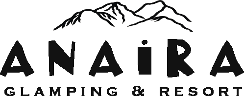

<p align="center">
  
</p>

# 🏕️ Anaira Glamping & Resort

**Anaira Glamping & Resort** adalah aplikasi booking glamping berbasis **QloApps** yang dikembangkan ulang untuk kebutuhan resort, villa, dan glamping di area **Jl. Raya Curug Nangka**. Project ini menggabungkan **backend hotel reservation QloApps**, **frontend Hotelier static responsive**, dan arsitektur payment Indonesia seperti **QRIS, Midtrans, Xendit, DOKU, Indopay/custom acquirer**, serta flow **UnionPay-capable** via provider/acquirer.

> Status saat ini: **MVP frontend sudah jalan di Vercel preview, backend QloApps/payment sudah masuk branch feature, tapi local backend PHP lint masih pending karena PHP belum tersedia di mesin local.**

---

## 🚀 Progress Terbaru

| Area | Status |
|---|---|
| Frontend Hotelier | ✅ Siap preview |
| Logo & visual assets | ✅ Terpasang |
| Google Maps link | ✅ Terpasang |
| WhatsApp booking | ✅ Terpasang |
| Vercel preview | ✅ Sudah pernah berhasil |
| Local static server | ✅ Ada script Node |
| Midtrans module | 🟡 Scaffold + hardening |
| Xendit module | 🟡 Scaffold + hardening |
| Multi-payment module | 🟡 Baseline architecture |
| DOKU adapter | 🟡 Stub/plan |
| Indopay adapter | 🟡 Stub, butuh docs resmi |
| PHP lint/test | ⚠️ Pending install PHP |
| Production deploy | ⏳ Belum final |

---

## ✨ Fitur Utama

### 🏡 Website Glamping Responsive

- Frontend static berbasis **Hotelier**.
- Mobile responsive untuk tamu yang booking dari HP.
- Halaman utama, kamar, galeri, paket, dan kontak.
- Hero image, gallery, video, favicon, OG image, dan brand logo Anaira.
- CTA booking langsung ke WhatsApp.

### 🛏️ Room & Rate Management

| Unit | Qty | Kapasitas | Weekday | Weekend |
|---|---:|---:|---:|---:|
| Balcony | 6 | 4 orang | Rp500.000 | Rp700.000 |
| Porch | 6 | 4 orang | Rp350.000 | Rp420.000 |
| Villa | 1 | 20 orang | Rp2.100.000 | Rp3.000.000 |

**Balcony**: AC, Android TV, amenities.  
**Porch**: Kipas, Android TV, amenities.  
**Villa**: AC, Android TV, kitchen, karaoke set.

### 🎁 Paket Tambahan

- 🍳 Breakfast
- 🔥 BBQ
- 💐 Honeymoon
- 👨‍👩‍👧 Family package

### 📍 Lokasi & Kontak

- **Lokasi**: Jl. Raya Curug Nangka
- **Google Maps**: https://maps.app.goo.gl/YVSmNtEsiK9tQNRS6
- **WhatsApp reservasi**: 081399693499
- **International format**: 6281399693499

### ⏰ Kebijakan Operasional

- Check-in: **13.00**
- Check-out: **12.00**
- Early check-in dan late checkout bisa disesuaikan.
- Cancel: **DP hangus**, tapi bisa **reschedule**.

### 🏊 Fasilitas Umum

- Kolam
- Cafe
- Api unggun
- Parkir
- Outdoor seating
- Mountain/nature view

---

## 💳 Payment Gateway Architecture

Project ini disiapkan untuk payment Indonesia, tapi tetap aman karena tidak menyimpan secret di source code.

| Provider | Status |
|---|---|
| Manual QRIS | ✅ Supported |
| WhatsApp reservation | ✅ Supported |
| Midtrans | 🟡 Scaffold |
| Xendit | 🟡 Scaffold |
| DOKU | 🟡 Adapter plan |
| Indopay | 🟡 Stub |
| UnionPay | 🟡 Via acquirer |

### 🔐 Security Notes

- Tidak ada hardcoded API key.
- Sandbox dan production dipisah via config.
- Webhook harus diverifikasi signature/token.
- Idempotency memakai `last_event_hash`.
- Amount mismatch harus ditolak.
- Log tidak boleh menyimpan full secret.

---

## 📁 Struktur Project Penting

```text
frontend/hotelier/                 # Static frontend demo Vercel
frontend/hotelier/assets/brand/    # Logo, favicon, OG image
frontend/hotelier/assets/images/   # Hero, rooms, facilities, gallery
frontend/hotelier/assets/video/    # Video Anaira Glamping
frontend/hotelier/scripts/         # Local static server
modules/midtranspayment/           # Midtrans module
modules/xenditpayment/             # Xendit module
modules/anairamultipayment/        # Unified payment architecture
data/seed_anaira.sql               # Seeder data Anaira
docs/ANairaGlamping.md             # Technical docs
docs/vercel-deploy.md              # Vercel guide
docs/LOCAL_PREVIEW_FIX.md          # Localhost troubleshooting
CHANGELOG_ANAIRA.md                # Project changelog
```

---

## 🖼️ Final Visual Assets

| Asset | Path |
|---|---|
| Logo black | `frontend/hotelier/assets/brand/logo-anaira-black-transparent.png` |
| Logo white | `frontend/hotelier/assets/brand/logo-anaira-white-transparent.png` |
| Favicon | `frontend/hotelier/assets/brand/favicon.ico` |
| OG image | `frontend/hotelier/assets/brand/og-anaira-glamping.jpg` |
| Hero desktop | `frontend/hotelier/assets/images/hero/hero-pool-mountain-desktop.webp` |
| Hero mobile | `frontend/hotelier/assets/images/hero/hero-pool-mountain-mobile.webp` |
| Gallery | `frontend/hotelier/assets/images/gallery/` |
| Video | `frontend/hotelier/assets/video/anaira-glamping-video.mp4` |

---

## 🧪 Local Preview

Kalau `http://localhost:4173/` menampilkan **ERR_CONNECTION_REFUSED**, artinya server local belum jalan. Jalankan dulu:

```powershell
cd "E:\Vibes CODING\AnairaGlamping\frontend\hotelier"
node scripts\static-server.js
```

Lalu buka:

```text
http://localhost:4173/
```

Alternatif PowerShell launcher:

```powershell
cd "E:\Vibes CODING\AnairaGlamping\frontend\hotelier"
.\scripts\start-local.ps1
```

Kalau port bentrok:

```powershell
netstat -ano | findstr :4173
taskkill /PID <PID> /F
node scripts\static-server.js
```

---

## 🌐 Vercel Demo Frontend

Frontend Vercel harus memakai root directory:

```text
frontend/hotelier
```

Run preview:

```powershell
cd "E:\Vibes CODING\AnairaGlamping\frontend\hotelier"
npx.cmd vercel --yes
```

Production deploy hanya dilakukan setelah local preview dan visual review aman:

```powershell
npx.cmd vercel --prod
```

> Catatan: project ini adalah hybrid. **Frontend static bisa di Vercel**, sedangkan **backend QloApps/PHP lebih cocok di shared hosting/VPS**.

---

## 🖥️ Shared Hosting Backend

Untuk backend QloApps:

1. Upload source backend ke shared hosting.
2. Buat database MySQL.
3. Import QloApps schema dan `data/seed_anaira.sql`.
4. Update `app/config/parameters.php`.
5. Aktifkan modul payment di admin.
6. Isi sandbox credentials provider.
7. Set HTTPS dan callback URL provider.

---

## ✅ Deploy Readiness

### Siap untuk preview

- ✅ Frontend static.
- ✅ Vercel config.
- ✅ Logo dan visual assets.
- ✅ WhatsApp booking.
- ✅ Google Maps link.
- ✅ Local static server script.

### Belum final production

- ⚠️ PHP belum dilint di mesin local.
- ⚠️ Payment gateway perlu sandbox credential.
- ⚠️ Webhook harus diuji end-to-end.
- ⚠️ Backend QloApps harus dites di environment PHP 8.1+.
- ⚠️ Admin panel perlu smoke test setelah import DB.

**Kesimpulan:** aplikasi **siap untuk frontend preview/demo**, tapi **belum 100% production-ready** untuk transaksi real sampai PHP lint, sandbox payment, webhook, dan shared hosting backend selesai diuji.

---

## 🧾 Changelog Ringkas

Lihat changelog project khusus Anaira di:

```text
CHANGELOG_ANAIRA.md
```

Ringkasan:

- ✅ Fork QloApps menjadi Anaira Glamping.
- ✅ Frontend Hotelier static ditambahkan.
- ✅ Room/unit data Anaira dimasukkan.
- ✅ Payment module Midtrans dan Xendit dibuat.
- ✅ Unified payment architecture `anairamultipayment` ditambahkan.
- ✅ Vercel static frontend disiapkan.
- ✅ Visual assets Anaira ditambahkan.
- ✅ Local Node static server dibuat.
- 🟡 PHP/runtime QA masih pending.

---

## 📌 PR & Development Flow

Branch aktif:

```text
feature/anaira-glamping
```

Target PR:

```text
develop
```

Workflow:

```text
Codex edit → local preview → push branch → Vercel preview → visual review → merge → production deploy
```

---

## 📜 License

Project ini adalah fork dari QloApps. Lisensi asli QloApps tetap dipertahankan sesuai upstream (**OSL/AFL**). Custom branding dan integrasi Anaira ditambahkan untuk kebutuhan Anaira Glamping & Resort.
