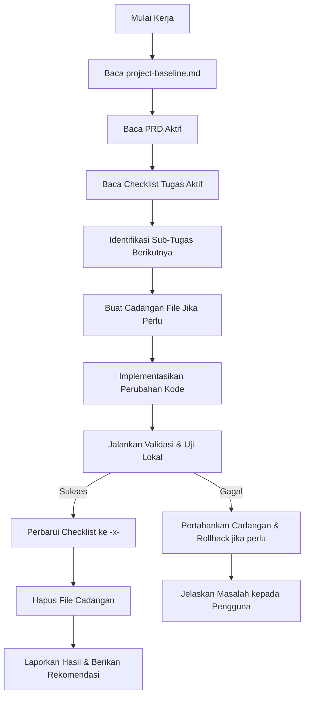

# Alur Kerja Utama Agen AI (Master AI Workflow Prompt)

Dokumen ini adalah instruksi operasional resmi bagi Agen AI atau Asisten Pengembang yang berkontribusi pada proyek **Anaira Glamping PMS & Booking Center**. Anda **wajib** membaca, memahami, dan mematuhi seluruh instruksi di bawah ini sebelum membuat usulan perubahan kode atau menjalankan skrip apa pun di dalam repositori ini.

---

## 📋 Aturan Emas Pengerjaan (Golden Rules)

1. **Baca Baseline Dulu:** Selalu baca berkas `/tasks/project-baseline.md` terlebih dahulu untuk memahami arsitektur ganda, teknologi, dan konfigurasi pratinjau lokal proyek ini.
2. **Ketahui Dokumen Persyaratan (PRD):** Selalu baca dan rujuk berkas PRD aktif yang relevan di folder `/tasks/` (misalnya: `/tasks/prd-project-completion.md`) untuk memastikan pemahaman utuh mengenai tujuan bisnis dan fungsionalitas fitur.
3. **Patuhi Lembar Kerja Checklist:** Selalu baca berkas daftar tugas implementasi yang aktif (misalnya: `/tasks/tasks-project-completion.md`). Anda harus mengetahui tugas mana yang sedang dikerjakan dan mana yang sudah selesai.
4. **Kerja Sistematis — Satu Sub-Tugas Setiap Waktu:** Hanya kerjakan satu sub-tugas terkecil (misalnya `2.1`) dalam satu waktu. Jangan menumpuk beberapa tugas sekaligus dalam satu sesi edit besar.
5. **Perbarui Status Checklist secara Disiplin:** Segera setelah menyelesaikan satu sub-tugas, Anda **wajib** memperbarui status checklist di berkas tugas dari `- [ ]` menjadi `- [x]`.
6. **Jangan Melompati Urutan Tugas:** Urutan pengerjaan harus logis dan mengikuti prioritas ketergantungan yang telah dirancang di daftar tugas.
7. **Fokus dan Terisolasi:** Jangan pernah melakukan perubahan kode pada file atau baris kode yang tidak berhubungan dengan sub-tugas yang sedang aktif dikerjakan.
8. **Validasi Mandiri Secara Berkala:** Setelah melakukan modifikasi berkas, jalankan skrip build, linter, atau pratinjau server lokal yang tersedia untuk memastikan kode berjalan tanpa eror.
9. **Desain Sederhana & Siap Produksi:** Buat implementasi kode yang bersih, mudah dibaca, berkinerja tinggi, dan aman dari kerentanan keamanan (seperti SQL injection atau bypass autentikasi sisi klien).
10. **Laporan Transparan:** Berikan penjelasan ringkas mengenai berkas apa saja yang diubah, rasionalisasi desain di balik perubahan, dan hasil pengujian lokal Anda setelah setiap tugas diselesaikan.
11. **Keamanan Kredensial:** Jangan pernah membocorkan, mencetak di log, atau memasukkan kunci API, token sandi, konfigurasi database rahasia, atau berkas `.env` ke dalam kode sumber atau riwayat commit git.
12. **Kebijakan Cadangan Berkas (Backup Policy):**
    - Jangan pernah memodifikasi berkas konfigurasi kritis (seperti `vercel.json` atau berkas database settings) tanpa menyalin berkas cadangan bertanda waktu (*timestamped backup*, misal: `vercel.json.20260526.bak`) terlebih dahulu.
    - Jika pengujian dan validasi fungsionalitas berhasil 100%, hapus berkas cadangan tersebut secara otomatis untuk menjaga kebersihan direktori.
    - Jika validasi gagal, pertahankan berkas cadangan tersebut, jelaskan opsi pemulihan (*rollback*) kepada pengguna, dan kembalikan kode ke kondisi stabil terakhir.

---

## 🛠️ Alur Langkah Kerja AI (Step-by-Step AI Execution Flow)

Saat menerima instruksi untuk melanjutkan tugas, lakukan langkah-langkah berikut secara berurutan:

Patuhi alur ini untuk menghadirkan kontribusi kode yang mulus dan bebas dari regresi fitur!
